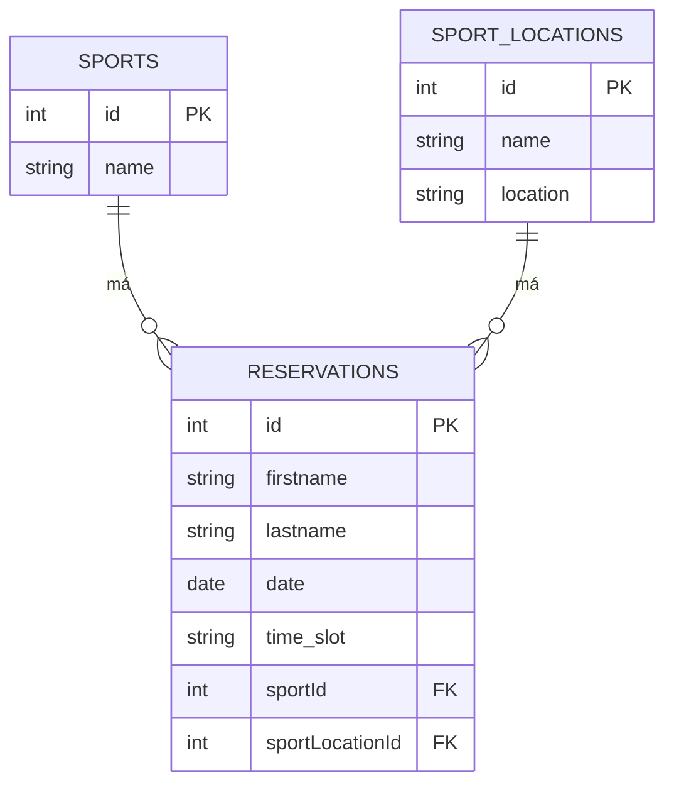

## Databázový diagram

```mermaid
erDiagram
  SPORTS ||--o{ RESERVATIONS : "má"
  SPORT_LOCATIONS ||--o{ RESERVATIONS : "má"

  SPORTS {
    int id PK
    string name
  }

  SPORT_LOCATIONS {
    int id PK
    string name
    string location
  }

  RESERVATIONS {
    int id PK
    string firstname
    string lastname
    date date
    string time_slot
    int sportId FK
    int sportLocationId FK
  }
```
